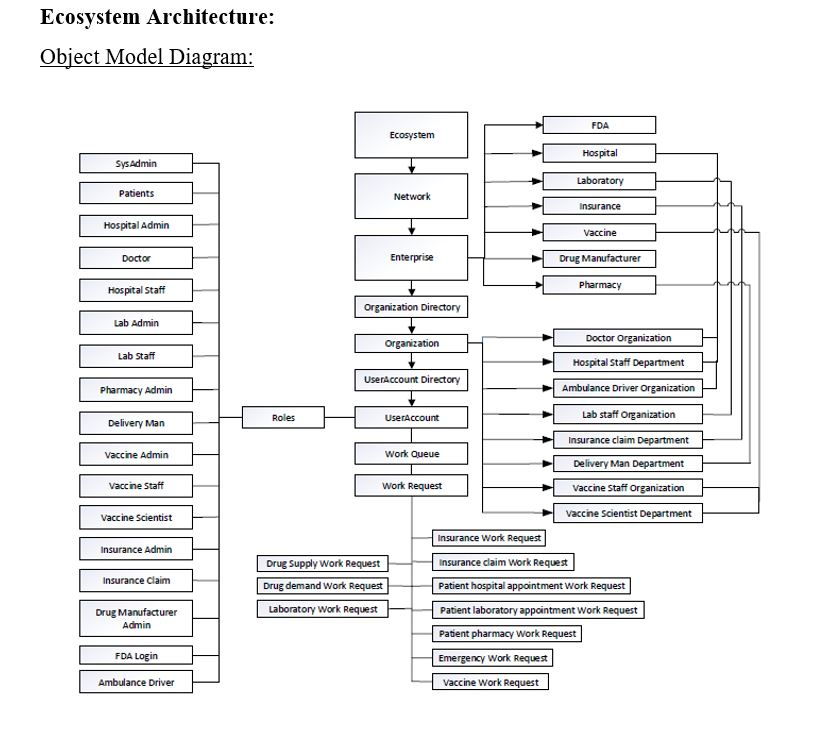

# MedTech Healthcare Application

The MedTech Healthcare is an improved java application for the healthcare system. This application is a single stop for patients to place all their healthcare needs like hospital visits, lab testing, pharmacy requirements along with insurance coverage. It keeps a track of patient health records and automatically process the insurance coverage.This application also helps to track and facilitates new drugs, test the drugs and attain FDA approval. Once approved it sends the drug to mass produced by the drug manufacture enterprise and be available in the pharmacy.

## Setup

- Download and install jdk_8 here
- Setup the JAVA_HOME system variable
- Clone or fork this repository.

## Required jar files
- itext-pdfa-5.5.13.2.jar
- com.lowagie.text-2.1.7.jar
- jcommon-1.0.23.jar
- jfreechart-1.0.13.jar
- twilio-8.4.0-jar-with-dependencies.jar
- activation.jar
- mail.jar
- jcalendar-1.4.jar
- db4o-8.0.jar

## Programming Language 
- Java 
- HTML
- CSS
- JavaScript
- SQL

## Development Tools
- Netbeans IDE

